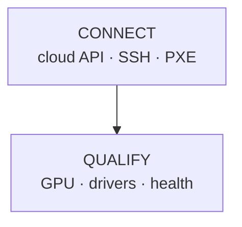

# Sample Commands

## Install and use

1. Download the installer.

```bash
curl --proto '=https' --tlsv1.2 -fsSLO https://github.com/qike-ms/draftpane/releases/latest/download/install.sh
# Expect: `install.sh` exists in the current directory
```

2. Install the latest checksummed release without Cargo.

```bash
sh install.sh && rm install.sh
# Expect: `Installed DraftPane at .../.local/bin/draftpane`
```

3. Start DraftPane on a Markdown file.

```bash
$HOME/.local/bin/draftpane README.md
# Expect: an editor pane and a high-contrast live preview; left click moves the cursor, mouse-wheel scrolling moves both panes, Markdown tables have borders, and supported Mermaid flows render as boxes/arrows
```

4. Update an installed copy to the latest checksummed release.

```bash
draftpane update
# Expect: `Installed DraftPane at .../draftpane`
```

5. Show the installed version.

```bash
draftpane --version
# Expect: `draftpane <version>`
```

6. Uninstall DraftPane.

```bash
installer=$(mktemp "${TMPDIR:-/tmp}/draftpane-install.XXXXXX") && curl --proto '=https' --tlsv1.2 -fsSL https://github.com/qike-ms/draftpane/releases/latest/download/install.sh -o "$installer" && sh "$installer" --uninstall; rc=$?; rm -f "$installer"; exit $rc
# Expect: `Removed .../.local/bin/draftpane`
```

## Develop from source

Run these from the repository root with Rust 1.88 or newer.

7. Start DraftPane on its README.

```bash
cargo run --locked -- README.md
# Expect: an editor pane and a live preview pane
```

8. Run tests.

```bash
cargo test --locked
# Expect: `test result: ok`
```

9. Check formatting and lint rules.

```bash
cargo fmt --check && cargo clippy --locked --all-targets --all-features -- -D warnings
# Expect: exit status 0 with no warnings
```

10. Build the release binary.

```bash
cargo build --locked --release
# Expect: `target/release/draftpane` exists
```

11. Preview a terminal-native Mermaid flow.

````bash
cat > /tmp/draftpane-flow.md <<'EOF'

EOF
draftpane /tmp/draftpane-flow.md
# Expect: two bordered boxes connected by a down arrow
````

12. Audit locked dependencies after installing `cargo-audit` once.

```bash
cargo audit
# Expect: no known vulnerability errors
```

## Common failures

| Failure | Fix |
|---|---|
| `usage: draftpane <markdown-file>` | Supply exactly one file path. |
| File is not valid UTF-8 | Convert it to UTF-8 before opening. |
| File exceeds 1 MiB | Use another editor or reduce the file size. |
| Installer reports `unsupported platform` | Use macOS/Linux on arm64/x86-64 or build from source. |
| `draftpane: command not found` after install | Add `$HOME/.local/bin` to `PATH` or use the full path. |
| Installer or updater reports checksum failure | Retry later; do not bypass verification. |
| `draftpane update` reports permission denied | Reinstall to a user-writable directory such as `$HOME/.local/bin`; do not run it as root. |
| Update cannot reach GitHub | Check network access and retry; the installed version remains unchanged. |
| Save reports an external change | Preserve the buffer, reopen/compare the disk file, then retry. |
| Terminal display remains altered after a crash | Run `reset`; then report the failing path and terminal version. |
